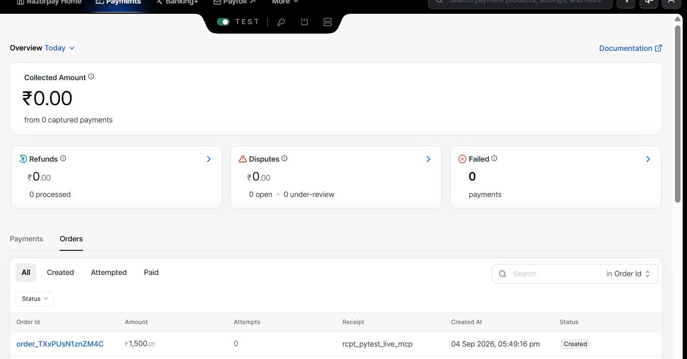

# Orders Stuck in `Created` & Razorpay Route

## 1. Problem
When autonomous purchases were tested against the live Razorpay Sandbox:
- Orders appeared on [dashboard.razorpay.com](https://dashboard.razorpay.com/app/orders), but remained permanently stuck in status **`Created`**.
- Attempts showed **`0`**.
- The collected revenue showed **`₹0.00 from 0 captured payments`**.

Additionally, our marketplace has 3 distinct merchants (**FastFeet**, **ShoeKart**, and **UrbanKicks**). Standard developer test accounts only support a single master account, and Razorpay's Linked Account API (`POST /v2/accounts`) returned `400 Bad Request: "Route feature not enabled for the merchant"`.

## 2. Image


## 3. What I Did to Fix
1. **Live S2S Test Payment Execution (`app/modules/razorpay/client.py`)**:
   - Replaced the in-memory `pay_<uuid>` mock with an authentic Server-to-Server (S2S) card payment call (`POST /v1/payments`).
   - Built automated parsing of Razorpay's mock bank 3DS redirect challenge, submitting the authorization callback (`success="S"`) to complete capture.
2. **Dual-Mode Razorpay Route Architecture (`app/modules/razorpay/route.py`)**:
   - **Active Route Mode:** Dynamically attaches `transfers` directly to orders when Route accounts are enabled.
   - **Virtual Route Mode (Sandbox Default):** Injects structured Route metadata into live orders:
     ```json
     {
       "merchant_id": "fastfeet",
       "merchant_name": "FastFeet",
       "route_mode": "virtual_route",
       "route_target": "acc_fastfeet_route"
     }
     ```
     And tracks transactions in an immutable, disk-backed multi-merchant settlement ledger (`adk_agents/data/merchants/route_ledger.json`).

## 4. Why
An order in Razorpay only moves from `Created` to `Paid` when an authorization attempt succeeds against the payment rails. The mock capture in local memory never communicated with Razorpay. S2S domestic test card capture guarantees payments transition to `CAPTURED` and orders to `PAID`. Virtual Route attribution solves the sandbox marketplace constraint by providing verifiable per-merchant accounting without requiring special partner permissions.
