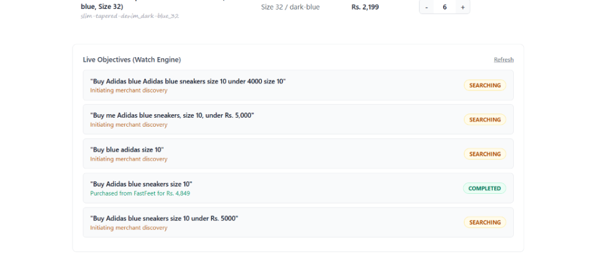

# The Silent Restock & The AP2 Human-Not-Present (HNP) Solution

## 1. Problem
At 2 AM during end-to-end testing of the **WATCH / Restock Engine**, a major conceptual and UX disconnect surfaced:
1. In the ADK Web chat UI (`http://127.0.0.1:8000`), a buyer asked:
   > *"Buy me Adidas sneaker for size 10, under 4K"*
2. Since ShoeKart had 0 stock (priced at Rs. 3,550), and competitors UrbanKicks (Rs. 4,899) and FastFeet (Rs. 4,906) exceeded the Rs. 4,000 budget, the agent placed the objective into **`WATCHING`** mode:
   > *"No qualifying store currently meets your budget or stock requirement. ShoeKart is out of stock. I have placed the request on WATCH and will automatically purchase it once stock is replenished."*
3. The tester navigated to the **Merchant Stock Control Portal** (`http://127.0.0.1:8001`), increased ShoeKart's stock from 0 to 5, and clicked **Update**.
4. The merchant terminal printed:
   ```text
   INFO:     127.0.0.1:59640 - "POST /api/stock/batch HTTP/1.1" 200 OK
   INFO:     127.0.0.1:59640 - "GET /api/merchants HTTP/1.1" 200 OK
   INFO:     127.0.0.1:59640 - "GET /api/objectives HTTP/1.1" 200 OK
   Direct use of automatic function calling (AFC) in Models.generate_content is not recommended...
   ```
5. But back in the ADK Web chat window, the screen was completely blank and idle. No tool accordion opened, and no message popped up.
6. The initial knee-jerk reaction was to add a toast notification on the Merchant Portal (`:8001`). But that immediately revealed a glaring architectural flaw:
   > **Why a toast notification on the Merchant Portal? What will a merchant on port 8001 do with a notification?**
   The Merchant Portal is the seller's warehouse tool. The seller does not buy goods or track buyer agent toasts! It is the **Buyer Agent** that needs to know:
   > *"Oh yeah! The item is back in stock again, and I have the user's authorization to buy it now!"*

---

## 2. The Solution in the AP2 Protocol (Human-Not-Present / HNP Modality)

The **Agent Payments Protocol (AP2)** (co-developed by Google and contributed to the FIDO Alliance) directly specifies how autonomous, delayed, and event-driven purchases must work.

### A. The Two AP2 Modalities
- **Human-Present (HP)**: The user is active in real-time dialog. The agent presents the cart, and the human signs or authorizes the transaction interactively.
- **Human-Not-Present (HNP)**: The user delegates an autonomous shopping task with explicit boundaries. The user is **NOT** sitting in front of the screen when the transaction executes hours or days later.

### B. The AP2 Intent Mandate as Pre-Authorization
In HNP mode, the user signs an **Intent Mandate** (`OpenCheckoutMandateModel` in our AP2 layer) before leaving:
- **Mandate Scope**: SKU (`adidas-runfalcon-3_blue_10`), Size (10), Color (Blue).
- **Spending Boundary**: `max_price`: Rs. 4,000.00.
- **Modality**: `auto_purchase: true`.
- **Validity Window**: Issued-At (`iat`) and Expiration (`exp`).
- **Cryptographic Signature**: ES256 signature binding the agent to act as the user's authorized delegate.

This Intent Mandate is the **legal and cryptographic proof of authorization** that empowers the AI agent to execute payments without asking for real-time human confirmation.

### C. Asynchronous Event Webhooks (Merchant -> Buyer Agent)
In AP2 + A2A, the Buyer Agent registers an asynchronous event callback or subscribes to the merchant network event bus:
1. When ShoeKart restocks (`POST /api/stock/batch`), the Merchant Agent dispatches an **A2A / AP2 Event Notification**:
   ```json
   {
     "event_type": "INVENTORY_CHANGED",
     "merchant_id": "merchant_b",
     "item_id": "adidas-runfalcon-3_blue_10",
     "payload": {"stock": 5, "price": 3800.0}
   }
   ```
2. The **Buyer Agent** ingests this event and correlates it with its active Intent Mandates.
3. The Buyer Agent reasons:
   > *"Event received from ShoeKart: SKU 'adidas-runfalcon-3_blue_10' is now in stock (5 units). I hold active AP2 Intent Mandate `obj_2e0d06fc04` pre-authorizing up to Rs. 4,000. Net price is Rs. 3,550. Constraints satisfied! Under my Human-Not-Present authority, I will assemble the Cart Mandate and execute payment!"*

### D. Cryptographic Mandate Chain Progression
1. **Intent Mandate** (`OpenCheckoutMandate`) -> Pre-authorizes the shopping mission.
2. **Cart Mandate** (`ClosedCheckoutMandate`) -> Generated via A2A checkout session, bound to the merchant's signed checkout hash.
3. **Deterministic Policy Gate** -> Evaluates price <= 4000, valid stock, merchant whitelist.
4. **Payment Mandate** (`ClosedPaymentMandate`) -> Binds the checkout hash to the Razorpay capture rail.
5. **Razorpay Settlement** -> Order created, payment captured, vendor payout triggered.
6. **AP2 Receipts** -> `CheckoutReceipt` and `PaymentReceipt` generated and chained to the immutable audit trail.

---

## 3. Visuals



---

## 4. What Was Implemented to Honor the AP2 Protocol

### Eliminated the Merchant Toast
Removed the artificial buyer toast from the Merchant Portal (`app/merchant_portal/server.py`). The merchant portal is strictly an inventory management dashboard that emits clean A2A events.

### Autonomous Background Execution Loop
In [`app/shopping_agent/orchestrator.py`](file:///d:/_try2/app/shopping_agent/orchestrator.py), `handle_merchant_event()` listens for `INVENTORY_CHANGED` events. When an event matches a `WATCHING` objective, it:
- Verifies the HNP Intent Mandate constraints.
- Re-evaluates proposals over A2A.
- Finalizes the Cart Mandate, Payment Mandate, and Razorpay capture autonomously.
- Transitions the objective from `WATCHING` -> `EVALUATING` -> `COMPLETED`.

### Agent Conversational State Synchronization
In [`adk_agents/shopping_agent/buyer_agent.py`](file:///d:/_try2/adk_agents/shopping_agent/buyer_agent.py), `check_order_or_watch_status()` links the disk-backed AP2 objective database to the ADK session state:
```python
if tool_context and hasattr(tool_context, "state") and tool_context.state is not None:
    tool_context.state["session:watch_status"] = latest.status.value
    if latest.purchase_result:
        tool_context.state["session:winning_merchant"] = latest.purchase_result.get("merchant")
        tool_context.state["session:item_purchased"] = latest.purchase_result.get("item_purchased")
        tool_context.state["session:amount_paid_inr"] = latest.purchase_result.get("amount_paid_inr")
```
When the human returns to the chat and asks *"Did you buy it?"* or *"Any updates?"*, the Buyer Agent knows precisely what occurred:
> *"I have purchased the Adidas Runfalcon 3 from ShoeKart for Rs. 3,550! Delivery is scheduled within 5 days."*


## Architectural Principle
The merchant portal never buys products; the merchant portal only reports inventory facts. The **Buyer Agent** is the autonomous fiduciary. By structuring autonomous purchases around the **AP2 Intent Mandate (HNP)**, the buyer agent remains fully authorized to act on market signals the millisecond they appear, while keeping the human's spending boundaries cryptographically enforced.