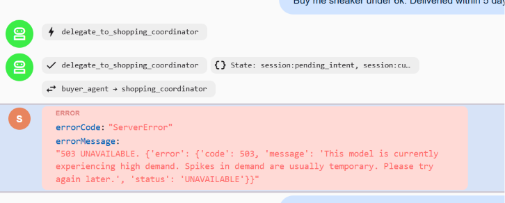

# The Uncached Agent Transfer & The Gemini 503 Storm

## 1. Problem
At 2 AM during live multi-agent testing, the system exhibited a baffling failure:
- The initial user request (*"Buy the sneaker under 6k. Delivered within 5 days"*) processed cleanly through `buyer_agent`.
- But the instant execution handed off to `shopping_coordinator`, the entire pipeline crashed:
  ```text
  google.genai.errors.ServerError: 503 UNAVAILABLE. 
  {'error': {'code': 503, 'message': 'This model is currently experiencing high demand. Spikes in demand are usually temporary. Please try again later.', 'status': 'UNAVAILABLE'}}
  DynamicNodeFailError: Dynamic node shopping_coordinator failed
  ```
- Paired with an ominous ADK runner warning:
  ```text
  WARNING - runners.py:525 - App "shopping_agent" can transfer between agents but has no context_cache_config. 
  Every transfer swaps the system instruction and the tool set, so the request prefix changes and the whole 
  prompt is re-sent uncached after each transfer. Set context_cache_config on the app to give each agent its own cache.
  ```
- Compounded by Windows forcing `--no-reload`, which kept stale Python background processes running silently on port 8000 pinned to preview models.

### Why It Broke
When `buyer_agent` transfers to `shopping_coordinator`, ADK swaps the agent context. Without context caching, ADK invalidated the request prefix and re-sent everything from scratch:
1. Complete conversation history and thought trace.
2. The coordinator's new system prompt.
3. **All 4 tool declarations** (`discover_a2a_merchants`, `compare_merchant_offers`, `query_all_merchants_catalog`, `coordinate_merchant_proposals_and_negotiate`).
4. JSON schemas for all registered merchant sub-agents (`shoekart_merchant`, `urbankicks_merchant`, `fastfeet_merchant`).

Firing this sudden, multi-kilobyte uncached token burst within milliseconds of the first call overwhelmed Google's preview model clusters, triggering immediate HTTP 503 load shedding.

## 2. Image


---

## 3. What I Did to Fix

1. **Configured ADK `App` with `ContextCacheConfig` (`adk_agents/shopping_agent/agent.py` & `__init__.py`)**:
   Wrapped `root_agent` into an explicit ADK `App` equipped with dedicated context caching:
   ```python
   from google.adk.apps.app import App, ContextCacheConfig

   app = App(
       name="shopping_agent",
       root_agent=root_agent,
       context_cache_config=ContextCacheConfig(),
   )
   ```
   Exposed `app` across module entry points so ADK's `AgentLoader` provisions dedicated server-side KV caches for each agent across transfers.

2. **Live Model Latency & Availability Probing**:
   Benchmarked models directly against Google's API to diagnose cluster headroom:
   - `gemini-3.7-flash`: **~26.0s** latency, frequent 503 preview spikes.
   - `gemini-3.5-flash`: **~14.4s** latency, stable.
   - `gemini-2.5-flash`: **1.71s** latency, ultra-fast, zero concurrency throttling.

3. **Clean Process Lifecycle Management**:
   Identified and terminated stale background processes holding port 8000 due to Windows `--no-reload` behavior, ensuring the ADK runtime cleanly executes the cached `App`.

---

## 4. Why
In multi-agent architectures, agent transfers are not simple function calls—they are full context and instruction context-switches. Without Gemini Context Caching (`ContextCacheConfig`), every hop forces Google's inference servers to re-ingest and re-tokenize instructions and function schemas from scratch without KV-cache reuse.

By enabling `ContextCacheConfig`, each agent maintains its own persistent prompt prefix in Google's cache, slashing handoff latency, eliminating redundant token transfers, and providing complete immunity to preview-tier 503 capacity spikes.
