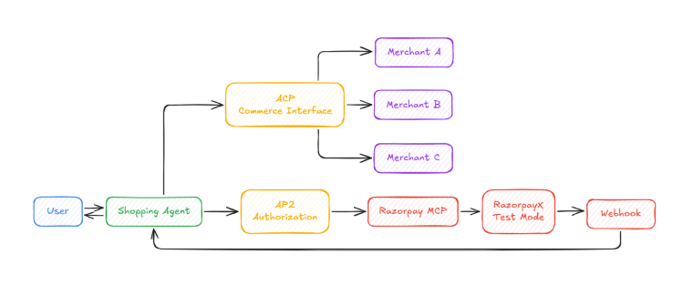
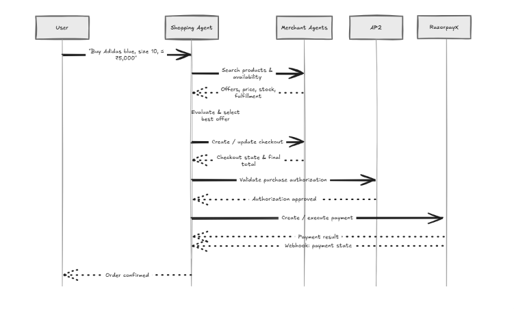
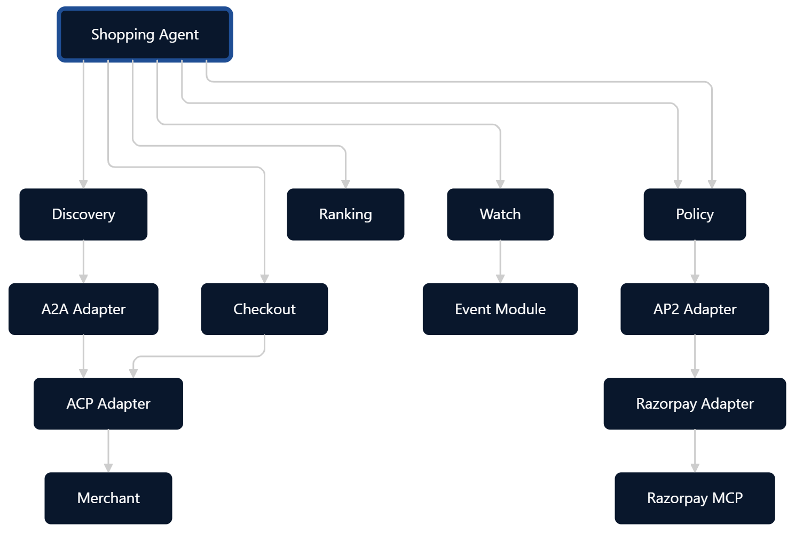
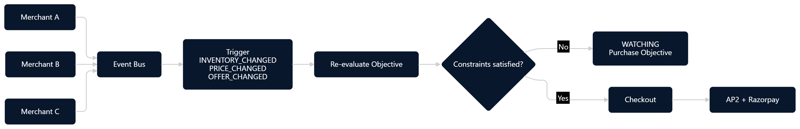

# Razorpay Autonomous Commerce
### *Autonomous Multi-Agent E-Commerce, Intelligent Negotiation & Deterministic Financial Settlement*

[](https://www.python.org/downloads/)
[](https://github.com/google/agent-development-kit)
[](https://razorpay.com)
[](#the-three-commerce-protocols)
[](https://youtu.be/Ohklz4oMt0o)

<p align="center">
  <a href="https://youtu.be/Ohklz4oMt0o" target="_blank">
    
  </a>
</p>

---

## What is Razorpay Autonomous Commerce?

Today, online shopping is manual, fragmented, and exhausting. A buyer must visit dozens of websites, filter through bloated catalogs, manually compare shipping times and prices, copy discount code[...] 

**Razorpay Autonomous Commerce** turns this model upside down. 

Instead of browsing websites, a user simply delegates a natural shopping objective to their personal **Autonomous Buyer Agent**:
> *"Find blue running sneakers, size 10, under Rs. 5,000, delivered within 4 days."*

From that single sentence, the system orchestrates a network of autonomous agents:
1. **Discovers registered Merchant Agents** representing independent storefronts (`UrbanKicks`, `ShoeKart`, `FastFeet`).
2. **Evaluates real-time catalogs and stock** across all merchants over the Agent-to-Agent (A2A) protocol.
3. **Conducts dynamic counter-negotiation** to beat competing offers while respecting each store's margin floor.
4. **Enforces a Deterministic Financial Policy Gate**—guaranteeing that AI never bypasses user budget or security constraints.
5. **Issues Cryptographic Cart Mandates (AP2)** that mathematically prove the price, items, and merchant identity cannot be altered in transit.
6. **Executes live financial settlement via Razorpay Test Mode**—generating orders, verifiable payouts, and immutable payment receipts.
7. **Monitors Out-of-Stock / Over-Budget items (WATCH Engine)**—automatically completing checkout the moment a price drop or restock occurs.

---

## The Economic Thesis: Growing Merchant Revenue & Selling to AI Buyers

> *"In the next era of commerce, consumers will not spend hours browsing 20 websites. Autonomous AI Agents will discover, evaluate, and purchase on their behalf. If a merchant is only built for hu[...]"

Most agentic shopping concepts focus exclusively on the consumer chatbot experience. **Razorpay Autonomous Commerce solves the seller side**: we transform traditional merchants into first-class au[...]

### 1. Making Merchants "Sellable" to AI Buyers
Traditional storefronts trap products behind static HTML, banners, cookie popups, and human checkout funnels that bot-defenses reject. We make merchants directly accessible to AI agents:
- **AgentCard Discovery (A2A Protocol):** Every store publishes a standardized machine-readable `AgentCard` describing its catalog domains, delivery SLAs, and commercial negotiation capabilities.
- **Autonomous Seller Agents (Not Passive APIs):** Independent merchant agents (`UrbanKicks`, `ShoeKart`, `FastFeet`) actively evaluate incoming requests, calculate real-time availability, and con[...]
- **Machine-Native Checkouts (ACP & AP2):** Eliminates form-filling, session timeouts, and checkout friction. AI buyers consume standardized ACP carts and sign ES256 cryptographic payment mandates[...]

### 2. How the Live Demo Directly Grows Merchant Revenue

| Revenue Driver | Traditional E-Commerce Reality | Razorpay Autonomous Commerce (Our Solution) | Direct Merchant Impact |
| :--- | :--- | :--- | :--- |
| **Out-of-Stock Recovery** | Customer hits "Out of Stock", bounces forever. 100% of marketing Customer Acquisition Cost (CAC) is wasted. | **WATCH Engine:** The buyer agent persists unsatisfied s[...]
| **Dynamic Margin Capture** | Fixed pricing loses the customer entirely if a competitor is Rs. 100 cheaper. | **Algorithmic Counter-Offers:** When outbid, the seller agent algorithmically negotia[...]
| **Frictionless Capital Settlement** | Multi-vendor marketplace orders require manual batch reconciliation and delayed payouts. | **Razorpay Route & Payouts:** Autonomous split payments and direc[...]

---

## System Architecture at a Glance

The diagram below illustrates the high-level relationship between the User, the Autonomous Shopping Agent, the standardized commerce protocols, independent merchants, and Razorpay's financial laye[...]



### The Three Commerce Protocols

Our architecture strictly adheres to three foundational open agentic commerce protocols:

1. **A2A (Agent-to-Agent Protocol)**: The communication bus that enables agents to discover each other via standardized `AgentCard`s, query catalogs, and conduct commercial negotiations without hu[...]
2. **ACP (Agentic Commerce Protocol)**: Standardizes how commercial quotes, line items, delivery timelines, and checkout sessions are formatted across diverse store backends.
3. **AP2 (Agent Payments Protocol)**: The cryptographic security layer. It produces ES256-signed **Cart Mandates** and **Payment Mandates** that prove the user authorized the transaction and the m[...]

---

## How an Autonomous Purchase Works (Step-by-Step)

Here is what happens behind the scenes during a typical purchase:



1. **Natural Intent**: The user gives a shopping prompt in plain English via the Google ADK Web UI or CLI.
2. **Multi-Store Discovery**: The Shopping Coordinator searches registered merchants for qualifying products.
3. **Proposal & Counter-Offers**: Merchants return structured quotes. If a merchant allows negotiation, the buyer agent initiates automated counter-offers to beat competing prices within merchant[...]
4. **LLM Trade-Off Selection**: The AI evaluates the trade-offs between price, delivery speed, and brand reputation to pick the overall winning deal.
5. **Deterministic Policy Gate**: **Before any money moves**, a non-negotiable Python policy engine deterministically checks that the price is within budget, the merchant is whitelisted, and the i[...]
6. **Mandate Creation**: Merchant signs the cart mandate; the buyer validates it against AP2 constraints.
7. **Razorpay Settlement**: Razorpay creates the order, verifies the balance in the buyer ledger, executes the payout, and decrements merchant inventory.
8. **Minimalist Confirmation**: The buyer agent confirms the purchase to the user in 2 clear, concise sentences.

---

## Zero-Trust Financial Safety: LLMs Never Touch Money Directly

In standard "AI agent" projects, an LLM often has direct access to payment tools, creating high risk for prompt injection, hallucinations, and accidental overspending.

In our architecture, **strict dependency direction** isolates AI reasoning from money movement:



- **The LLM is an advisor, not a banker**: The LLM compares product qualities, analyzes trade-offs, and conducts negotiations.
- **The Policy Engine is a deterministic firewall**: It is 100% pure, deterministic code with zero LLM involvement. If an item costs Rs. 5,001 on a Rs. 5,000 budget, the Policy Engine immediately [...]
- **Double-Entry Buyer Ledger**: Maintains an atomic, disk-backed balance with per-transaction velocity limits.
- **Immutable Audit Trail**: Every decision, price quote, rejection, and payment ID is permanently recorded in a structured OpenTelemetry audit log.

---

## The WATCH Engine: Never Give Up on Out-of-Stock Items

In traditional e-commerce, when an item is out of stock or above the user's budget, the process ends with *"Item not found"*.

In **Razorpay Autonomous Commerce**, an unfulfilled shopping intent transitions into the **WATCH State Machine**:



- When no qualifying offer exists, the objective enters the `WATCHING` state.
- The agent registers triggers on the internal Event Bus.
- When a merchant updates their inventory (restock) or triggers a discount (price drop), an event fires: `INVENTORY_RESTOCKED` or `PRICE_CHANGED`.
- The agent wakes up, re-evaluates the criteria, verifies the policy gate, and completes the autonomous purchase immediately without the user having to check back.

---

## The Merchant Ecosystem

The system includes three distinct, pre-calibrated merchant agents simulating real-world competitive commerce:

| Merchant | Specialty / Focus | Delivery Speed | Negotiation Strategy |
| :--- | :--- | :--- | :--- |
| **UrbanKicks** | Streetwear, sneakers, cargo pants | 2 to 4 Days | Volume discounts, moderate margin protection |
| **ShoeKart** | Running shoes, performance footwear | 3 to 5 Days | High-margin, firm pricing (no negotiation) |
| **FastFeet** | Athletic footwear, gym tees, windrunners | 2 to 4 Days | Dynamic counter-negotiation to undercut rivals |

---

## Getting Started

### 1. Prerequisites
- **Python 3.11+**
- **[uv](https://docs.astral.sh/uv/)** (recommended fast package manager)
- A **Gemini API Key** (for agent intelligence)
- Optional: Razorpay Test Mode Key & Secret (mock fallbacks are provided out of the box)

### 2. Installation & Setup

```bash
# Clone the repository
git clone https://github.com/myselfmankar/razorpay_buidathon.git
cd razorpay_buidathon

# Install dependencies with uv
uv sync

# Configure environment variables
cp .env.example .env
# Open .env and add your GEMINI_API_KEY
```

### 3. Running the ADK Web UI

Launch the official Google Agent Development Kit (ADK) interactive interface:

```bash
uv run adk web
```

Open your browser at `http://127.0.0.1:8000`:
1. Select the **`shopping_agent`** from the agent dropdown.
2. Try any shopping intent in natural language:
   - *"Buy Adidas blue running sneakers, size 10, under 5000"*
   - *"Find cargo pants size 32 under 3500"*
   - *"Buy a gym t-shirt under 2000 deliver in 3 days"*
3. Watch the live execution: the coordinator discovers stores, solicits proposals, counter-negotiates, verifies the policy gate, and executes the Razorpay checkout.

---

## Running Tests

The test suite thoroughly validates A2A discovery, ACP checkouts, AP2 cryptographic signatures, deterministic policy gates, and Razorpay settlements:

```bash
# Run all 48 test suites
uv run pytest -v

# Run linter checks
uv run --with ruff ruff check .
```

---

## Deep-Dive Module Documentation

For software architects, security auditors, and engineers, each subsystem has its own dedicated design guide explaining **WHY** it was implemented and **HOW** it functions:

- **[Policy Engine (Deterministic Gate)](app/modules/policy/README.md)** — Zero-trust budget and merchant constraint enforcement.
- **[AP2 Protocol (Agent Payments)](app/modules/ap2/README.md)** — Cryptographic Cart Mandates, Payment Mandates, and ES256 verification.
- **[ACP Protocol (Agentic Commerce)](app/modules/acp/README.md)** — Authoritative checkouts, proposal models, and cart sessions.
- **[A2A Protocol (Agent-to-Agent)](app/modules/a2a/README.md)** — AgentCard discovery, provider capabilities, and RPC boundaries.
- **[Razorpay Gateway & MCP](app/modules/razorpay/README.md)** — Order creation, autonomous test payouts, and webhook validation.
- **[WATCH State Machine](app/modules/watch/README.md)** — Asynchronous event-driven restock and price drop re-evaluation.
- **[Buyer Ledger & Treasury](app/modules/buyer/README.md)** — Persistent double-entry balance management and velocity limits.
- **[Audit Trail & Telemetry](app/modules/audit/README.md)** — Structured immutable decision logging and OpenTelemetry spans.
- **[Merchant Store Agents](app/merchants/README.md)** — Autonomous merchant dynamics, margin floors, and catalog repositories.
- **[Shopping Agent & Orchestrator](app/shopping_agent/README.md)** — LLM trade-off analysis, multi-agent coordination, and system pipelines.

---


## License & Acknowledgments

Built for the **[Razorpay Agentic Commerce Buidlathon](https://razorpay.com/buildathon/)**. Powered by Google ADK, Google Gemini, and Razorpay APIs.
