---

# 1. README — Main Architecture

This should be the first diagram people see.

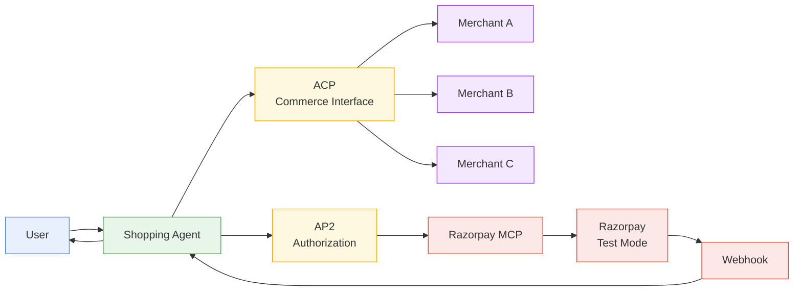

### What this communicates in 5 seconds

```text
User
 ↓
Shopping Agent
 ↓
ACP → Merchants
 ↓
AP2 → Authorization
 ↓
Razorpay → Payment
 ↓
Webhook → Agent
```

That's the **hero architecture**.

Don't put every internal component here.

---

# 2. README — Happy Path

Your current sequence diagram is already good. I'd make the final version slightly more accurate:

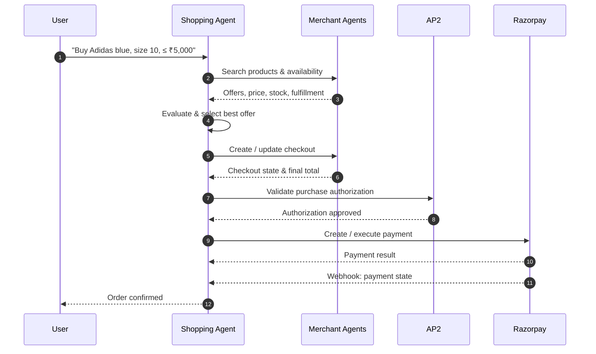

### One important design choice

Notice that **AP2 isn't between Merchant and Razorpay as a normal API hop**.

It's more like:

```text
Shopping Agent
      │
      ▼
"Am I authorized to do this?"
      │
      ▼
     AP2
      │
      ▼
Authorized
      │
      ▼
Razorpay payment execution
```

That distinction will matter when we implement it.

---

# 3. README — Your WATCH Flow

This is the one I'd keep **very minimal**.

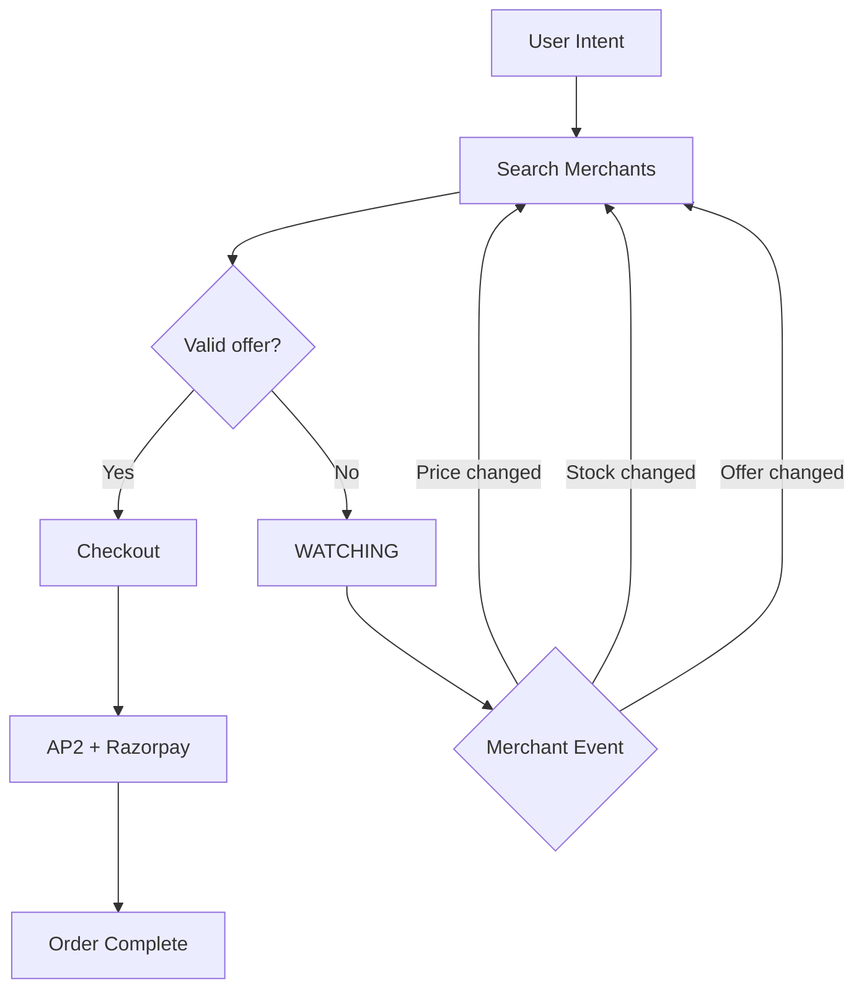

That's honestly enough.

It tells the whole story:

> **No offer doesn't mean failure. The agent keeps the objective alive.**

---

# 4. README — The entire product in one diagram

I would actually put this somewhere near the top of the README.

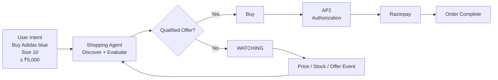

This is probably my favorite of the four for the **README**.

---

# 5. Now the engineering architecture

This is the diagram your **coding agent** should care about.

Here we expose the actual responsibilities.

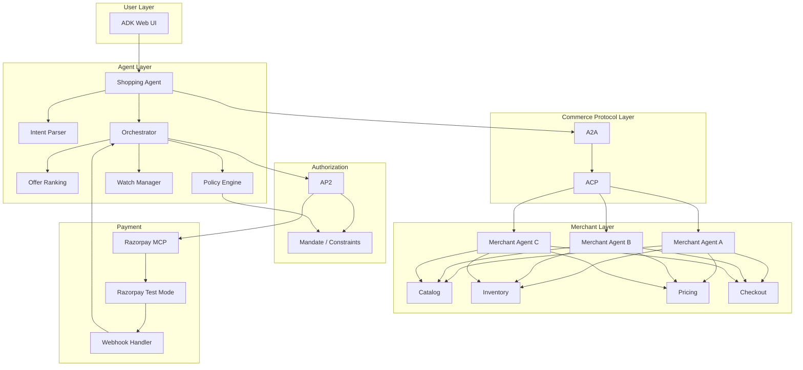

### This is the one I'd give your coding agent.

Because now it knows:

* ADK = runtime/UI
* Shopping Agent = intelligence
* A2A = agent communication
* ACP = commerce interaction
* AP2 = authorization
* Razorpay MCP = payment tool layer
* Razorpay = actual sandbox execution
* Webhook = asynchronous state
* Watch Manager = **our own feature**
* Policy Engine = **our safety boundary**
* Ranking = **our agentic intelligence**

---

# 6. Internal service diagram

Now let's get more serious.

I don't want the Shopping Agent to become a 2,000-line monster.

I'd structure its internals approximately like this:

```mermaid
flowchart TB

    AGENT["Shopping Agent"]

    AGENT --> INTENT["Intent Manager"]
    AGENT --> ORCH["Shopping Orchestrator"]

    ORCH --> DISCOVERY["Merchant Discovery"]
    ORCH --> EVAL["Offer Evaluator"]
    ORCH --> POLICY["Policy Engine"]
    ORCH --> CHECKOUT["Checkout Manager"]
    ORCH --> WATCH["Watch Manager"]

    DISCOVERY --> A2A["A2A Client"]
    A2A --> ACP["ACP Client"]

    ACP --> MERCHANTS["Merchant Agents"]

    EVAL --> RANK["Ranking Strategy"]

    POLICY --> CONSTRAINTS["Purchase Constraints"]
    POLICY --> MANDATE["AP2 Mandate"]

    CHECKOUT --> ACP
    CHECKOUT --> AP2["AP2"]

    AP2 --> PAYMENT["Payment Gateway"]
    PAYMENT --> MCP["Razorpay MCP"]

    MCP --> RZ["Razorpay"]

    WATCH --> EVENTBUS["Event / Trigger Bus"]
    EVENTBUS --> DISCOVERY

    RZ --> WEBHOOK["Webhook"]
    WEBHOOK --> EVENTBUS
```

This is where I'd make an important engineering rule:

> **The LLM should not directly control everything.**

For example:

```text
LLM
 │
 ├── decide which merchant looks best
 │
 └── decide whether to continue searching
```

But:

```text
Policy Engine
 │
 ├── max price
 ├── product constraints
 ├── autonomous purchase allowed?
 └── mandate valid?
```

should be **deterministic**.

And:

```text
Razorpay MCP
 │
 ├── create order
 ├── payment
 └── refund
```

should be exposed as **controlled tools**, not arbitrary API access.

That's going to be important for the Buildathon's:

> **"Every money action explainable, bounded and gated."**

---

# 7. The WATCH state machine

This should be an actual `stateDiagram`, because it is genuinely a state machine.

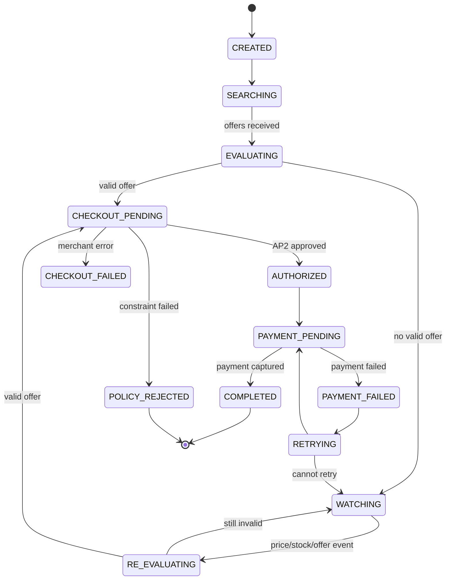

This is **not necessarily something I'd put in the README**.

This is for:

* you
* coding agent
* backend implementation
* tests

---

# 8. Event-driven WATCH architecture

This is the part I want you to think about carefully.

Don't make:

```text
WATCHING
   ↓
sleep(300)
   ↓
check stock
```

your primary mental model.

Instead:

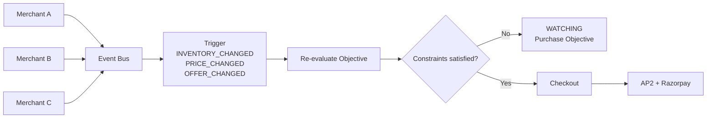

But there's a practical MVP point:

### We don't need real event infrastructure initially.

Our first implementation can have:

```text
Event Bus
    ↓
In-memory event queue
```

or even a simple trigger endpoint.

Later:

```text
Razorpay webhook
Merchant webhook
Timer
Manual trigger
```

can all become event sources.

So the abstraction is:

```text
Event Source
     ↓
Event
     ↓
Watch Manager
     ↓
Re-evaluate
```

rather than:

```text
Cron specifically.
```

---

# 9. The most important data-flow diagram

This one is for your coding agent.

> **"This is the data that travels through the system. Don't invent random structures unless necessary."**

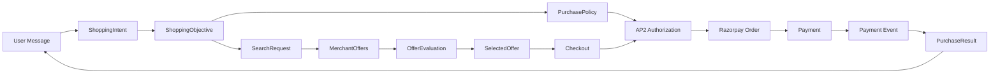

And when nothing qualifies:

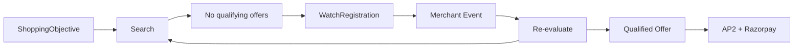

---

# 10. Now repository structure


```text
/
├── README.md
├── pyproject.toml
├── uv.lock
│
├── apps/
│   ├── shopping_agent/
│   └── merchant_agent/
│
├── modules/
│   ├── acp/
│   ├── ap2/
│   ├── a2a/
│   ├── razorpay/
│   ├── watch/
│   ├── policy/
│   └── events/
│
├── merchants/
│   ├── merchant_a/
│   ├── merchant_b/
│   └── merchant_c/
│
├── tests/
│   ├── unit/
│   ├── integration/
│   └── scenarios/
│
├── docs/
│   ├── architecture/
│   ├── flows/
│   └── decisions/
│
└── scripts/
```

### Why `apps/`?

Because:

```text
shopping_agent
merchant_agent
```

are **running applications/services**.

Whereas:

```text
ap2
acp
a2a
razorpay
watch
policy
```

are **modules/components**.

That's a much cleaner Go-style mental model.

---

# 11. Inside each module

Your idea of having a README inside each module is actually **very good for this project**, especially because you're using a coding agent.

For example:

```text
modules/
└── policy/
    ├── README.md
    ├── models.py
    ├── evaluator.py
    ├── constraints.py
    └── errors.py
```

The README should explain:

```text
# Policy Module

## Responsibility
Deterministically verifies whether an autonomous purchase
is permitted.

## Input
ShoppingObjective
SelectedOffer
AP2 mandate

## Output
ALLOW / REJECT

## Rules
- price <= maximum_price
- requested variant matches
- autonomous_purchase == true
- mandate is valid

## Must NOT
- make network requests
- call LLM
- initiate payment
```

That last section is **extremely useful for your coding agent**.

---

# 12. Same thing for `watch`

```text
modules/
└── watch/
    ├── README.md
    ├── models.py
    ├── manager.py
    ├── triggers.py
    ├── evaluator.py
    └── state.py
```

README:

```text
# Watch Module

## Responsibility
Maintain shopping objectives that currently have
no qualifying offer.

## Lifecycle

SEARCHING
→ WATCHING
→ RE-EVALUATING
→ CHECKOUT

## Events
- inventory_changed
- price_changed
- offer_changed

## Must NOT
- decide payment authorization
- bypass policy engine
- directly call Razorpay
```

This gives your coding agent **architectural guardrails**.

---

# 13. I'd structure the protocol modules differently

For example:

```text
modules/
├── acp/
│   ├── README.md
│   ├── client.py
│   ├── models.py
│   └── checkout.py
│
├── ap2/
│   ├── README.md
│   ├── client.py
│   ├── mandates.py
│   └── authorization.py
│
├── a2a/
│   ├── README.md
│   ├── client.py
│   ├── discovery.py
│   └── agent_card.py
│
└── razorpay/
    ├── README.md
    ├── tools.py
    ├── payments.py
    ├── orders.py
    └── webhooks.py
```

The important principle:

> **Protocol modules should be thin adapters.**

Don't put business logic there.

Bad:

```text
ACP
 └── choose_best_merchant()
```

Good:

```text
ACP
 └── search_products()
```

Then:

```text
Shopping Agent
 └── choose_best_merchant()
```

---

# 14. The dependency direction I want

This is probably the most important technical diagram for your coding agent.

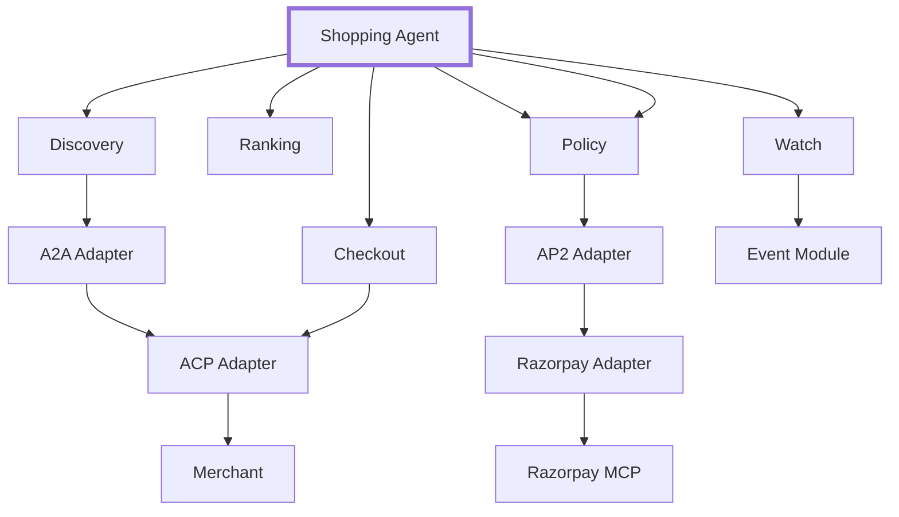

### Translation:

```text
Business logic
      ↓
Protocol adapters
      ↓
External systems
```

**Never the reverse.**

For example:

```text
❌ Razorpay module deciding which sneaker to buy

❌ ACP module deciding whether ₹5,000 is acceptable

❌ AP2 module ranking merchants

✓ Shopping Agent makes decisions
✓ Policy enforces constraints
✓ Protocol modules perform protocol operations
✓ Razorpay executes payment
```

This separation will save us from creating spaghetti.
